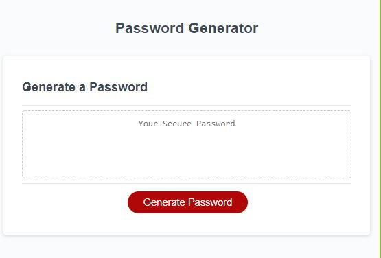
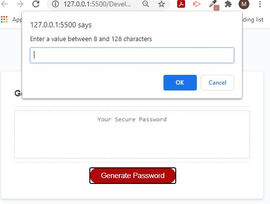
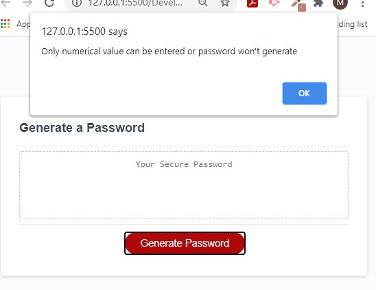
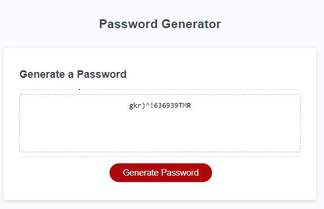

# Password Generator Website

A site that allows a user to generate a unique password with characters between 8 and 128.

## Functionality

Users will be prompted to also include the following:

Lowercase
Uppercase
Special Character
Numeric value

## End result

The end result will provide the user with a unique password meeting the criteria of the users selections.

## Additional

Files have been setup as:

HTML
CSS
JAVASCRIPT

## Live URL
https://mskippen.github.io/Password-Generator/.

© 2021 Megan Skippen
